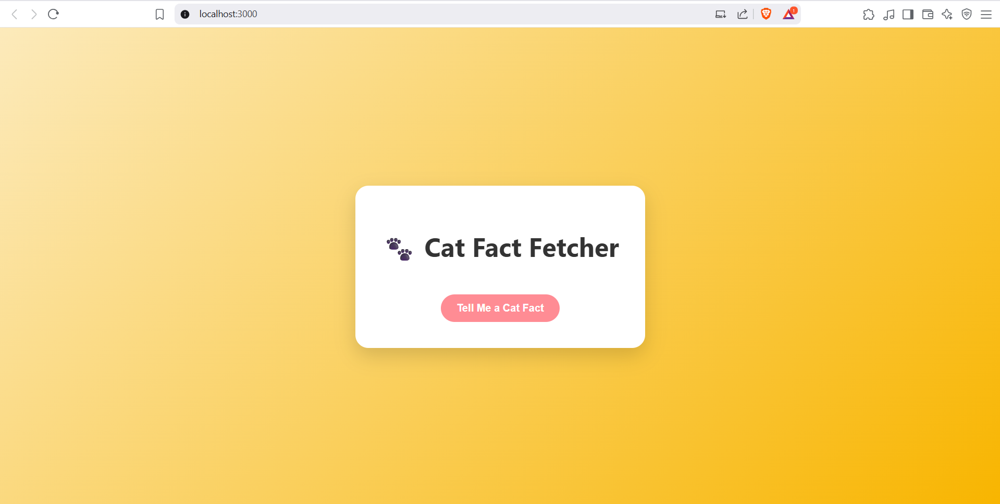
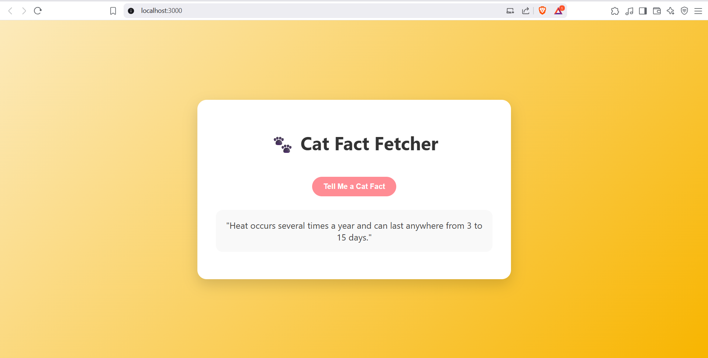

# 🐱 Cat Fact Fetcher - Yogotribe Frontend Challenge

This is a simple React app that fetches a random cat fact from a public API using async/await and displays it on the screen.

## 🔧 Features
- Single button to fetch fact
- Uses `https://catfact.ninja/fact`
- Async/await with error handling
- Responsive and clean layout

## 🚀 Getting Started

```bash
npm install
npm start

## Tech Used
React
JavaScript (ES6+)
HTML/CSS

## Screenshot

